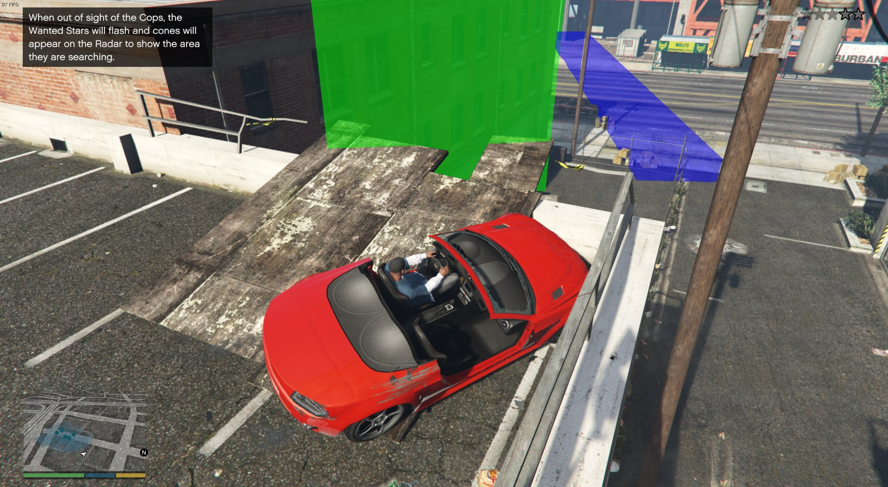

# Stunt Jump Practice

A modification for Grand Theft Auto V

[WIP] Renders boxes for the start/end targets of stunt jumps

## Requirements

- ScriptHookV

## Usage

Drop the `.asi` file into your Grand Theft Auto V folder.

## Screenshot

At the moment, the boxes are ugly and we don't know how to account for `ADD_STUNT_JUMP_ANGLED`.

