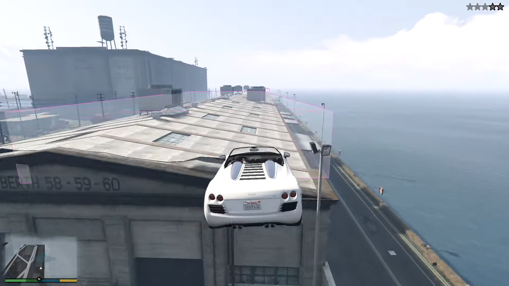

# Stunt Jump Practice

A modification for Grand Theft Auto V

[WIP] Renders boxes for the start/end targets of stunt jumps

## Requirements

- ScriptHookV

## Building

Download the ScriptHookV SDK, and clone this repo into the 'samples' folder.

Then, open the `vcxproj` up in Visual Studio. (I use Visual Studio 2019 Community, so the platform toolset is set to v147 or something)

## Usage

Drop the `.asi` file into your Grand Theft Auto V folder.

## Screenshot

